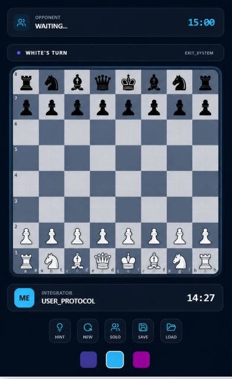
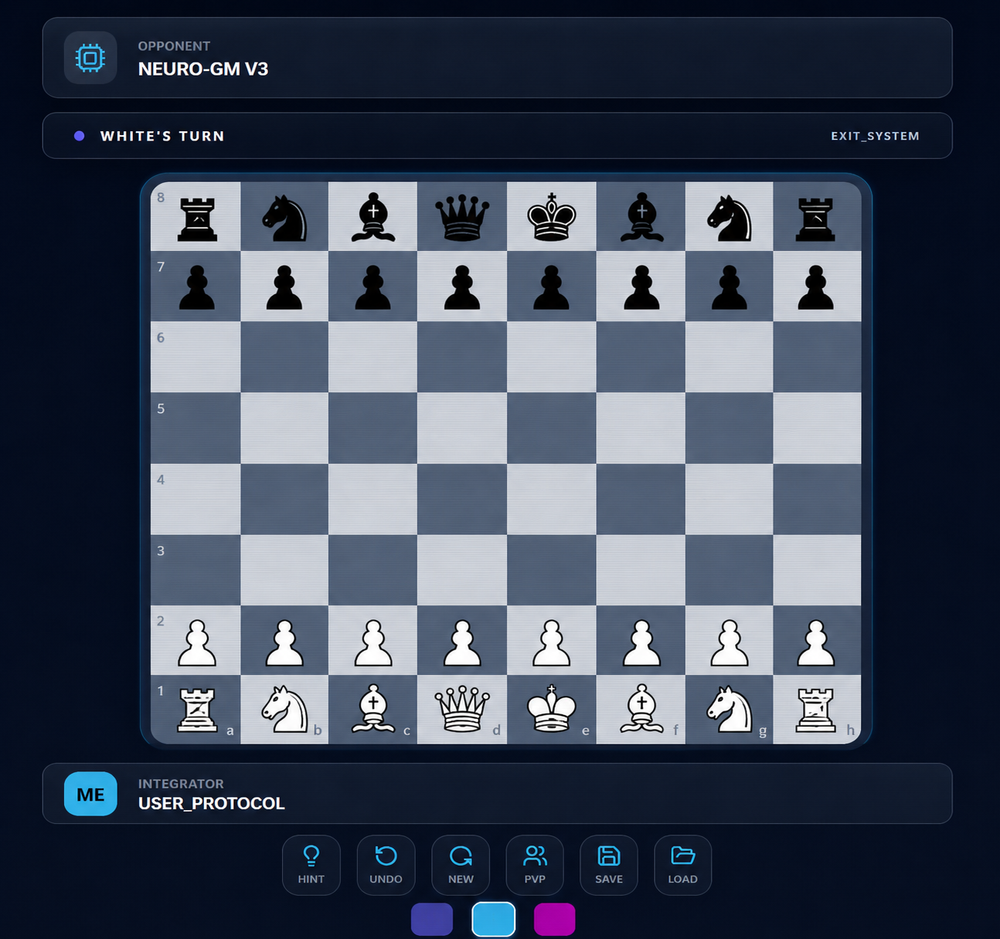

# ♟️ Chess_Neuro  
⚡ Think Smart. Play Faster. Dominate The Board. ⚡

Chess_Neuro is a modern futuristic chess experience that blends ♟️ strategic gameplay with 🌌 cyber-inspired UI aesthetics. Designed with smooth interactions, intelligent AI gameplay, tactical hint systems, and immersive visual design, the project reimagines traditional chess with a clean modern interface and responsive gameplay mechanics.

The game focuses on delivering an engaging Player vs Player and Player vs AI experience while supporting complete chess mechanics including legal move validation, check/checkmate detection, castling, pawn promotion, undo functionality, and strategic gameplay assistance.

---

## ✨ Features

- ♟️ Complete Chess Gameplay System
- 🤖 Smart AI Opponent
- 👥 Player vs Player Mode
- 🧠 Player vs AI Mode
- 💡 Tactical Hint System
- ↩️ Advanced Undo Functionality
- ⏱️ PvP Timer System
- 👑 Check & Checkmate Detection
- 🔄 Pawn Promotion, Castling & En Passant
- 🎨 Futuristic Cyber-Themed UI
- ⚡ Smooth Animations & Responsive Controls
- 📱 Responsive Gameplay Experience

---

## 🧠 Tech Stack

- ⚛️ React.js
- 🎨 Tailwind CSS
- ♟️ Chess Engine Logic
- 🚀 Modern UI/UX Design
- 🧩 Component-Based Architecture
- 🤖 AI-assisted Prompt Engineering Workflow

---

## 🌐 Live Demo

🎮 Play Chess_Neuro Online Demo

🔗 https://neurochess-arena.vercel.app

---

## 📸 Screenshots

### 🎮 Main Menu


### ♟️ Player vs Player Gameplay


### 🤖 Player vs AI Gameplay


---

## 🚀 Development Highlights

Designed using iterative prompt engineering workflows with focus on:

- ♟️ Legal chess move validation
- 🤖 Stable AI opponent behavior
- 💡 Tactical gameplay hint system
- ⚡ Smooth turn-based interactions
- 🎨 Futuristic cyber-style interface design
- ↩️ Advanced undo system logic
- 📱 Responsive and minimal UI structure
- 🧠 Performance-focused gameplay optimization

---

## 📎 Run Locally

```bash
git clone https://github.com/Divyeshb3/Chess_Neuro.git
```

---

## ⭐ Support

If you like this project, consider giving it a ⭐ on GitHub and supporting the development of more futuristic gaming experiences! 🚀♟️
